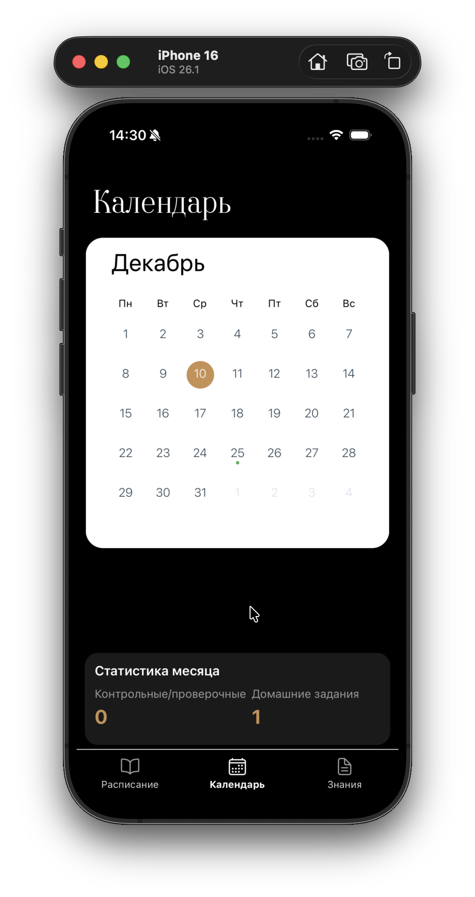
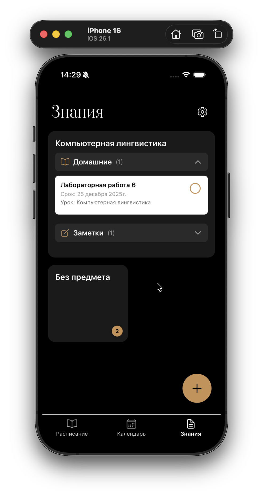

<div align="center">

# StudyOrganizer

### A cross-platform mobile organizer for students

<div align="center">
  
  
  
</div>

[](https://reactnative.dev/)
[](https://expo.dev/)
[](https://react.dev/)
[](https://www.typescriptlang.org/)
[](https://www.sqlite.org/)
[](https://reactnative.dev/)

*Course project — Kuban State University, Faculty of Computer Technologies and Applied Mathematics*

</div>

---

## About

**StudyOrganizer** is a mobile app for students that brings everything around studying into one place: schedule, deadlines, notes, flashcards, and grades. It is built on **React Native** + **Expo** with **Expo Router** for navigation, and runs on both iOS and Android from a single TypeScript codebase.

All data is stored locally in SQLite — the app is fully functional offline and requires no account.

---

## Features

| Area | Description |
|---|---|
| **Schedule** | Weekly timetable with single-week and bi-weekly (A/B) formats, editing, and a first-launch setup wizard |
| **Calendar** | Day view of everything happening on a given date: lessons, homework, control works, tests, exams |
| **Knowledge base** | Markdown notes organized by subject and folders, with cross-links between notes |
| **Flashcards** | Extracts cards from Markdown notes, review mode with spaced repetition (SM-2 algorithm) |
| **Grades** | Tracks grades for exams, control works, and tests per subject |
| **Vault Sync** | Import / export the knowledge base in an Obsidian-compatible format |
| **Streak** | Tracks consecutive days of flashcard review activity |
| **Theming** | Light / dark / system theme |
| **Local-first** | All data stored in on-device SQLite, no account or network required |

---

## Tech stack

- **Framework:** [React Native](https://reactnative.dev/) 0.83 + [Expo](https://expo.dev/) SDK 55
- **Language:** TypeScript 5.9
- **UI:** React 19, Reanimated 4, expo-blur, expo-glass-effect, expo-linear-gradient
- **Navigation:** [Expo Router](https://docs.expo.dev/router/introduction/) with typed routes
- **Database:** SQLite via `expo-sqlite`
- **Charts:** `react-native-gifted-charts`, `react-native-chart-kit`
- **Calendar:** `react-native-calendars`
- **Markdown:** `react-native-markdown-display`
- **Build:** Expo CLI, EAS Build, Metro

---

## Getting started

### Prerequisites

- [Node.js](https://nodejs.org/) 18 or later
- npm 9+
- [Expo Go](https://expo.dev/client) on your phone *or* Xcode / Android Studio for simulators

### Install and run

```bash
git clone https://github.com/hostrrr/study-organizer-app.git
cd study-organizer-app

npm install

npx expo start
```

Then:

- scan the QR code with **Expo Go**, or
- press `i` to open the iOS simulator, `a` for the Android emulator.

For native builds (with custom native modules):

```bash
npx expo run:ios
npx expo run:android
```

---

## Project structure

```
StudyOrganizer/
├── app/                         # Expo Router — screens and navigation
│   ├── _layout.tsx              # Root Stack + DB / fonts / theme bootstrap
│   ├── (tabs)/                  # Bottom tab navigation
│   │   ├── _layout.tsx
│   │   ├── schedule.tsx         # Weekly schedule
│   │   ├── calendar.tsx         # Date-based calendar
│   │   └── notes.tsx            # Knowledge base / subjects
│   ├── startup.tsx              # First-launch setup wizard
│   ├── add-lesson.tsx           # Add a lesson
│   ├── edit-schedule.tsx        # Edit the timetable
│   ├── add-homework.tsx         # Add homework / control work
│   ├── lesson-details.tsx       # Lesson details
│   ├── date-details.tsx         # Day details
│   ├── subject-details.tsx      # Subject details (notes, grades, exams)
│   ├── note-editor.tsx          # Markdown note editor
│   ├── flashcard-review.tsx     # Flashcard review session
│   ├── vault-sync.tsx           # Knowledge base import / export
│   └── settings.tsx             # App settings
├── components/                  # Reusable UI components
│   └── ui/                      # Base UI primitives (FAB, containers, icons)
├── hooks/                       # Data-access and state hooks
├── database/                    # SQLite: schema (db.ts), queries, debug seeds
├── constants/                   # Theme and color tokens
├── utils/                       # Utilities (Markdown flashcards, exams, etc.)
├── types/                       # Domain model types
├── assets/                      # Icons, fonts, images, screenshots
├── scripts/                     # Helper scripts (e.g., reset-project)
├── app.json                     # Expo configuration
├── eas.json                     # EAS Build configuration
├── package.json
└── tsconfig.json
```

---

## Database schema

A local SQLite database (`study-organizer.db`) with the following main tables:

| Table | Purpose |
|---|---|
| `subjects`, `teachers` | Subject and teacher reference data |
| `lessons` | Timetable lessons (day, time, room, A/B-week format) |
| `homework` | Homework items linked to lessons |
| `tasks` | Generic tasks and reminders |
| `exams` | Control works, tests, credits, exams |
| `grades` | Grades per subject / exam |
| `notes` / `notes_v2` | Notes (legacy and the new v2 schema with Markdown and tags) |
| `note_folders`, `note_links` | Folders and cross-links between notes |
| `flashcards` | Flashcards with spaced repetition state (SM-2) |
| `review_log` | Review history for streaks and analytics |
| `attachments` | Files, images, links |
| `app_settings` | Internal flags and versions |

Migrations are applied inline in `database/db.ts` via `PRAGMA table_info` + `ALTER TABLE`.

---

## Architecture

The app is split into clear layers:

- **UI layer** — React Native screens and components, local state via hooks
- **Data layer** — custom hooks (`hooks/use-*`) on top of SQL queries in `database/queries.ts`
- **DB layer** — `database/db.ts` (schema + migrations) using synchronous `expo-sqlite`
- **Navigation** — Expo Router with typed routes; modal screens via `presentation: 'modal'`

---

## Testing

The app has been tested on:

- a physical Android device
- the iOS simulator (Xcode)
- Expo Go (iOS and Android)
- multiple screen sizes (phone and tablet)

---

## License

Developed as a **course project** at Kuban State University (2025–2026).
Free to use as reference material or as a starting point for your own projects.

---

<div align="center">

Made by **G. S. Nazarenko**
Kuban State University · 2025–2026

</div>
